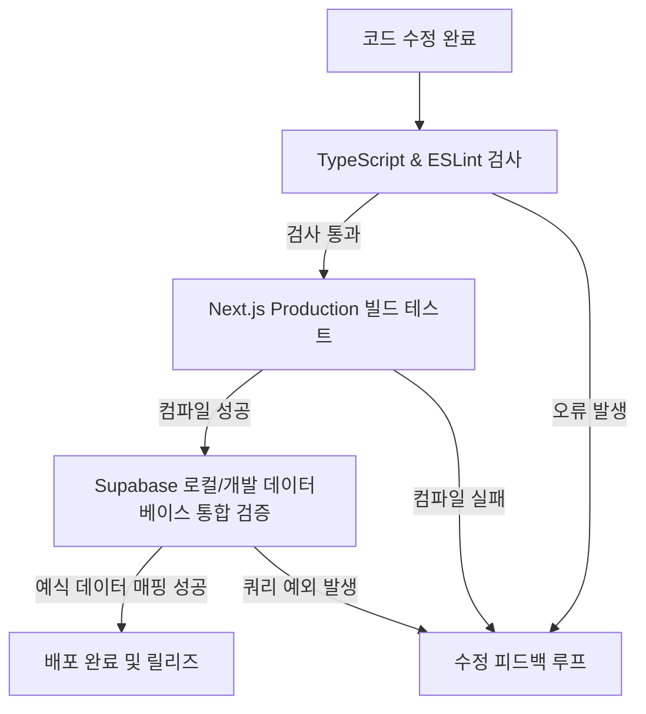

# 빌드 검증 및 성공 기준 명세서 (HARNESS.md)

이 문서는 VOW SEOUL 모바일 청첩장 웹 애플리케이션의 품질 검증 흐름, 빌드 및 배포 배포를 위한 성공 조건, 실패 시 중단 조건 등을 규정합니다.

---

## 1. 테스트 및 검증 흐름 (Verification Flow)

개발 및 빌드 파이프라인에서 코드를 통합하기 전에 거쳐야 하는 검증 단계는 다음과 같습니다.



---

## 2. 검증 도구 및 실행 방법 (Validation Tools)

### 2.1 정적 타입 및 코드 스타일에 관한 검증
개발 과정과 CI 단계에서 소스 코드의 문법 규칙과 타입 정합성을 준수하는지 검사합니다.
```bash
# Eslint 검사 및 오류 탐지
pnpm lint
```

### 2.2 빌드 검증 (Production Build verification)
배포본 패키징이 에러 없이 실행되는지 확인합니다. Next.js 빌드 성공은 모든 페이지 구성 컴포넌트의 유효성과 동적 라우트 검증을 통과했음을 의미합니다.
```bash
# 프로덕션 빌드 실행
pnpm build
```

---

## 3. 기능별 통과 및 성공 기준 (Success Criteria)

다음 기능적 핵심 시나리오들이 완벽히 통과해야 배포 완료로 인정합니다.

### 3.1 정보 수집 및 복구 시나리오
* **성공 기준**:
  1. 모바일 폼 페이지(`form/[slug]`) 입력 중 페이지를 닫거나 강제 리프레시 후 재배포 시, 입력되어 있던 정보들이 소실되지 않고 100% 복구되어 폼에 재탑재되어야 함.
  2. 고객이 폼 최종 제출 완료 시 `customers.status`가 즉각 `'form_completed'`로 전환되어야 함.
  3. `SELECT_TEXT`의 자유 추가 문구 및 `timentext`의 다중 일시/내용 데이터가 DB `form_submissions` 테이블의 JSON 컬럼에 올바르게 구조화되어 등록되어야 함.

### 3.2 청첩장 자동 생성 및 싱크 시나리오
* **성공 기준**:
  1. 고객 상세 정보 화면에서 `🔄 최신 폼 제출 내용으로 청첩장 업데이트하기` 클릭 시 최신 `form_submissions`의 데이터 필드들이 `invitations.content_data` 및 `bgm_url`에 빈 필드 없이 안전하게 전이되어야 함.
  2. 업데이트 성공 알림 토스트 메시지가 호출되고 에러 로그가 남지 않아야 함.

### 3.3 편집기 및 하객 프리뷰
* **성공 기준**:
  1. 에디터 헤더의 뒤로가기 클릭 시 이전 페이지(브라우저 이전 히스토리)로 올바르게 이동해야 함.
  2. 모바일 브라우저(특히 KakaoTalk 인-앱 브라우저 및 Safari)에서 BGM 재생 버튼 클릭 시 소리가 끊기거나 로딩 무한루프 없이 0초 시점부터 매끄럽게 사운드가 재생되어야 함.

### 3.4 대시보드 실데이터 동적 카운트
* **성공 기준**:
  1. `/admin` 대시보드 및 `/admin/statistics` 접속 시 Supabase의 실제 `customers` 및 `invitations` 테이블 행을 기반으로 매출 및 테마 선호 차트가 표기되어야 하며, API 호출 실패로 인한 런타임 오류가 발생하지 않아야 함.

---

## 4. 중단 및 실패 처리 기준 (Abort Criteria)

1. **빌드 컴파일 에러 발생 시**: `next build` 과정 중 `Failed to compile` 관련 타입 오류 혹은 코드 오류 발생 시 배포를 즉각 중단하고 이전 버전으로 롤백합니다.
2. **PostgreSQL RLS / 권한 위반 에러 발생 시**: Supabase API 쿼리가 HTTP 403 혹은 406 등으로 실패하는 경우, 폼 제출 및 업데이트를 정지시키고 API 정책(RLS) 및 client single() 호출의 변경점을 전면 취소합니다.
3. **개인정보 파기 트리거 실패 시**: 예식 14일 경과 대상 고객의 RSVP 정보가 자동 파기 프로세스에서 걸러지지 않고 하객 정보가 노출 상태로 남아있는 경우, 해당 트리거 함수 동작을 확인하고 수동 보정을 마칠 때까지 신규 하객 RSVP 접수 기능을 임시 중단시킵니다.
