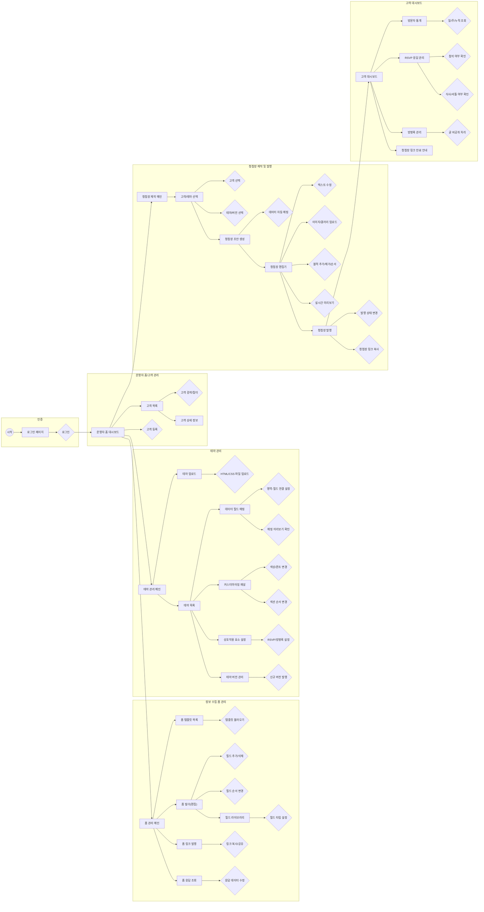

```mermaid
flowchart LR

  subgraph s1 ["인증"]
    n1(("시작"))
    n2["로그인 페이지"]
    n3{"로그인"}
  end

  subgraph s2 ["운영자 홈/고객 관리"]
    n4["운영자 홈 대시보드"]
    n5["고객 목록"]
    n6{"고객 검색/필터"}
    n7["고객 상세 정보"]
    n8{"고객 등록"}
  end

  subgraph s3 ["정보 수집 폼 관리"]
    n9["폼 관리 메인"]
    n10["폼 템플릿 목록"]
    n11{"템플릿 불러오기"}
    n12["폼 빌더(편집)"]
    n13{"필드 추가/삭제"}
    n14{"필드 순서 변경"}
    n15["필드 라이브러리"]
    n16{"필드 타입 설정"}
    n17["폼 링크 발행"]
    n18{"링크 복사/공유"}
    n19["폼 응답 조회"]
    n20{"응답 데이터 수정"}
  end

  subgraph s4 ["테마 관리"]
    n21["테마 관리 메인"]
    n22["테마 목록"]
    n23["테마 업로드"]
    n24{"HTML/CSS 파일 업로드"}
    n25["데이터 필드 매핑"]
    n26{"영역-필드 연결 설정"}
    n27{"매핑 미리보기 확인"}
    n28["커스터마이징 패널"]
    n29{"색상/폰트 변경"}
    n30{"섹션 순서 변경"}
    n31["상호작용 요소 설정"]
    n32{"RSVP/방명록 설정"}
    n33["테마 버전 관리"]
    n34{"신규 버전 발행"}
  end

  subgraph s5 ["청첩장 제작 및 발행"]
    n35["청첩장 제작 메인"]
    n36["고객/테마 선택"]
    n37{"고객 선택"}
    n38{"테마/버전 선택"}
    n39["청첩장 초안 생성"]
    n40{"데이터 자동 매핑"}
    n41["청첩장 편집기"]
    n42{"텍스트 수정"}
    n43{"이미지/갤러리 업로드"}
    n44{"블럭 추가/제거/순서"}
    n45{"실시간 미리보기"}
    n46["청첩장 발행"]
    n47{"발행 상태 변경"}
    n48{"청첩장 링크 복사"}
  end

  subgraph s6 ["고객 대시보드"]
    n49["고객 대시보드"]
    n50["방문자 통계"]
    n51{"일/주/누적 조회"}
    n52["RSVP 응답 관리"]
    n53{"참석 여부 확인"}
    n54{"식사/셔틀 여부 확인"}
    n55["방명록 관리"]
    n56{"글 비공개 처리"}
    n57["청첩장 링크 만료 안내"]
  end

  n1 --> n2
  n2 --> n3
  n3 --> n4
  n4 --> n5
  n5 --> n6
  n5 --> n7
  n4 --> n8
  n4 --> n9
  n9 --> n10
  n10 --> n11
  n9 --> n12
  n12 --> n13
  n12 --> n14
  n12 --> n15
  n15 --> n16
  n9 --> n17
  n17 --> n18
  n9 --> n19
  n19 --> n20
  n4 --> n21
  n21 --> n22
  n21 --> n23
  n23 --> n24
  n22 --> n25
  n25 --> n26
  n25 --> n27
  n22 --> n28
  n28 --> n29
  n28 --> n30
  n22 --> n31
  n31 --> n32
  n22 --> n33
  n33 --> n34
  n4 --> n35
  n35 --> n36
  n36 --> n37
  n36 --> n38
  n36 --> n39
  n39 --> n40
  n39 --> n41
  n41 --> n42
  n41 --> n43
  n41 --> n44
  n41 --> n45
  n41 --> n46
  n46 --> n47
  n46 --> n48
  n46 --> n49
  n49 --> n50
  n50 --> n51
  n49 --> n52
  n52 --> n53
  n52 --> n54
  n49 --> n55
  n55 --> n56
  n49 --> n57
```
